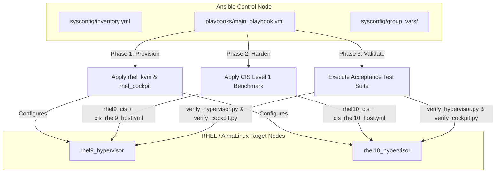

# Master Orchestration - Architecture & Engineering Justifications

## Executive Summary

The `rhel_hypervisor_master` repository is an enterprise-grade Ansible orchestration platform designed to provision, harden, and validate production-ready KVM hypervisors running **Red Hat Enterprise Linux (RHEL) 9 and 10** (and compatible derivatives such as AlmaLinux).

Rather than acting as a simple collection of scripts, this repository serves as the **Master Control Plane**. It manages the end-to-end infrastructure lifecycle by coordinating standalone infrastructure roles (`rhel_kvm`, `rhel_cockpit`), integrating upstream Center for Internet Security (CIS) Level 1 benchmark baselines (`ansible-lockdown`), maintaining strict variable isolation, and executing automated on-host acceptance verification.

---

## Directory Architecture & Component Responsibilities

The project layout follows strict enterprise separation of concerns:

```
rhel_hypervisor_master/
├── ansible.cfg                          # Central Ansible engine configuration
├── requirements.yml                     # Pinned upstream Galaxy roles and collections
├── .gitignore                           # Git hygiene (ignoring temp files, caches, retries)
│
├── playbooks/
│   └── main_playbook.yml                # 3-Phase sequential deployment pipeline
│
├── sysconfig/
│   ├── inventory.yml                    # Host inventory & dual-group hierarchy
│   │
│   ├── group_vars/                      # Strict variable isolation layer
│   │   ├── all.yml                      # Global execution feature toggles
│   │   ├── kvm_hosts/                   # Infrastructure role variables (split directory)
│   │   │   ├── kvm.yml                  # Storage pool paths, bridge definitions, admin users
│   │   │   └── cockpit.yml              # Session idle timeouts, banners, port configs
│   │   ├── cis_rhel9_host.yml           # Tailored CIS Level 1 overrides for RHEL 9
│   │   └── cis_rhel10_host.yml          # Tailored CIS Level 1 overrides for RHEL 10
│   │
│   └── host_vars/                       # Host-specific overrides (NIC names, RAID paths)
│       ├── rhel9_hypervisor.yml
│       └── rhel10_hypervisor.yml
│
├── docs/                                # Technical engineering documentation
│   ├── ARCHITECTURE_AND_JUSTIFICATIONS.md # Master architecture and design justifications
│   └── KNOWLEDGE_BASE_QA.md             # Architectural Q&A reference
│
└── roles/                               # Local cache of Galaxy roles (managed via requirements.yml)
    ├── rhel_kvm                         # Standalone KVM hypervisor provisioning role
    ├── rhel_cockpit                     # Standalone Cockpit web management role
    ├── rhel9_cis                        # Upstream CIS Level 1 benchmark for RHEL 9
    └── rhel10_cis                       # Upstream CIS Level 1 benchmark for RHEL 10
```

### Folder Responsibilities:

1. **`playbooks/`**: Contains the top-level orchestration workflow (`main_playbook.yml`). It enforces a deterministic, 3-phase execution order: Provisioning -> Security Hardening -> Acceptance Verification.
2. **`sysconfig/inventory.yml`**: Defines the deployment topology. It utilizes a dual-group structure:
   - `kvm_hosts`: Targets all hypervisors uniformly for base virtualization and management tools.
   - `cis`: Uses child groups (`cis_rhel9_host`, `cis_rhel10_host`) to automatically bind OS-specific benchmark variables without requiring separate playbooks.
3. **`sysconfig/group_vars/`**: Enforces strict variable namespaces. Infrastructure variables never touch CIS security variables, preventing variable contamination and preserving audit transparency.
4. **`requirements.yml`**: Uses declarative dependency management to pull version-pinned roles directly from source control, treating infrastructure code as modular software packages.

---

## Architectural Comparison: Old Structure vs. Modern Master Orchestrator

To understand why this architecture is superior, the table below contrasts the legacy approach (common in ad-hoc IT scripting) against this production-ready master orchestrator:

| Architectural Dimension | Old / Legacy Structure | Modern Master Orchestrator (`rhel_hypervisor_master`) | Technical Impact & Justification |
| :--- | :--- | :--- | :--- |
| **Code Modularity** | Monolithic "God Playbook" containing 500+ mixed tasks for KVM, firewall, packages, and security. | Decoupled, standalone roles (`rhel_kvm`, `rhel_cockpit`) pulled via `requirements.yml`. | Eliminates code duplication; roles can be tested, versioned, and reused independently across different projects. |
| **Variable Isolation** | Single monolithic `vars.yml` mixing storage paths, user passwords, and 200+ CIS security parameters. | Strict separation: `group_vars/kvm_hosts/` for infrastructure, `cis_rhelX_host.yml` for security. | Prevents accidental variable overrides; allows security auditors to inspect compliance settings without infrastructure clutter. |
| **Multi-OS Libvirt Support** | Hardcoded `systemctl start libvirtd`, which immediately fails on RHEL 10. | Dynamic OS detection: enables required monolithic `libvirtd` on RHEL 9 (with an explicit `rhel_kvm_libvirt_uri` socket path so the libvirt client can't drift to the modular socket), modular sockets on RHEL 10, and masks the daemon set not in use on each. | Guarantees seamless cross-generation hypervisor management without manual playbook branching. |
| **Web Console Architecture** | Desktop GUI installation (`virt-manager`, X11 packages, GNOME libraries) on the hypervisor. | Headless web console (`cockpit-machines`) managed via on-demand systemd socket activation (`cockpit.socket`). | Conserves 1.5+ GB of host RAM, reduces attack surface, eliminates X11 vulnerabilities, and satisfies CIS server profiles. |
| **Network & Storage Management** | Ad-hoc `virsh` shell commands and brittle raw bash scripts without state tracking. | Native Ansible modules (`community.libvirt.virt_pool`, `virt_net`) using declarative Jinja2 XML templates. | Ensures complete idempotency (`changed=0`), robust error reporting, and reliable state convergence. |
| **Security Hardening Model** | Custom, unverified bash scripts that break hypervisor bridges, block port 9090, and blacklists KVM drivers. | Official Ansible Lockdown CIS Level 1 roles with surgical variable overrides to protect virtualization. | Delivers verifiable enterprise compliance (CIS Level 1) while guaranteeing 100% operational hypervisor services. |
| **Verification & Quality Assurance** | Manual manual checks (`virsh list`, pinging VMs) with no structured reporting. | Automated on-host Python acceptance scripts (`verify_hypervisor.py`, `verify_cockpit.py`) executed in Phase 3. | Generates automated, human-readable compliance reports directly inside the Ansible execution summary. |

---

## Technical Justifications: Why This Architecture is Better

### 1. Multi-Stage Pipeline Sequencing (Why Phase Order Matters)

The master playbook executes three distinct phases in strict order:

```
[Phase 1: Infrastructure Provisioning]
   ├── rhel_kvm: Deploys QEMU, Libvirt daemons, storage pools, and network bridge
   └── rhel_cockpit: Deploys Cockpit web console and cockpit-machines on port 9090
            │
            ▼
[Phase 2: CIS Benchmark Level 1 Hardening]
   ├── rhel9_cis (on EL 9): Applies 200+ Level 1 controls with hypervisor whitelists
   └── rhel10_cis (on EL 10): Applies modern Level 1 controls with modular service protections
            │
            ▼
[Phase 3: Post-Deployment Verification & Security]
   ├── Automated acceptance test: /usr/local/bin/verify_hypervisor.py
   ├── Automated acceptance test: /usr/local/bin/verify_cockpit.py
   └── Security credential expiry: chage -d 0 root
```

**Technical Rationale:**
- **Provision Before Hardening**: Infrastructure packages, services, network bridges (`virbr0`, `kvm_br0`), and sockets (`cockpit.socket`) must exist before the security benchmark runs. When CIS executes, its firewall and auditing tasks detect the running services and properly apply tailored firewall rules (`firewalld_services: [ssh, cockpit]`) and kernel parameter exceptions (`net.ipv4.ip_forward = 1`).
- **Verify After Hardening**: Running the Python acceptance test suite in Phase 3 verifies that the system functions correctly *after* security remediation has been applied. If any CIS rule accidentally blocked a port or altered a permission, Phase 3 immediately catches the defect.
- **Security Root Expiry as Final Step**: Enforcing `chage -d 0 root` in Phase 3 guarantees that administrative access remains uninterrupted during automation, while ensuring that the hypervisor cannot be accessed post-deployment without a mandatory password reset.

### 2. Strict Variable Isolation & Precedence Mechanics

Enterprise security standards dictate that compliance baselines must be auditable and immutable.

#### Directory Layout in `sysconfig/group_vars/`:
- **`all.yml`**: Defines global safety toggles (`enable_kvm: false`, `enable_cockpit: false`). By defaulting to `false`, any host mistakenly added to the inventory without a specific role assignment will not execute provisioning tasks.
- **`kvm_hosts/`**: A multi-file directory containing role-specific infrastructure variables:
  - `kvm.yml`: Sets `enable_kvm: true`, defines storage pools, and configures bridge networking.
  - `cockpit.yml`: Sets `enable_cockpit: true`, configures session idle timeouts, and sets login banners.
- **`cis_rhel9_host.yml` & `cis_rhel10_host.yml`**: Contain version-specific CIS Level 1 variable overrides.

#### Variable Precedence in Action:
Ansible resolves variables using a strict hierarchy from general to specific:
1. Role Defaults (`roles/*/defaults/main.yml`) [Lowest]
2. Global Group Vars (`sysconfig/group_vars/all.yml`)
3. Target Group Vars (`sysconfig/group_vars/kvm_hosts/`)
4. Child OS Group Vars (`sysconfig/group_vars/cis_rhel9_host.yml`)
5. Host Vars (`sysconfig/host_vars/*.yml`) [Highest]

Because `kvm_hosts` is more specific than `all`, setting `enable_kvm: true` inside `sysconfig/group_vars/kvm_hosts/kvm.yml` cleanly overrides the fallback in `all.yml`. More importantly, CIS security variables (`rhel9cis_*`) never exist in the infrastructure files, meaning a developer tuning VM memory or disk pools can never accidentally disable a security audit rule.

### 3. Surgical CIS Level 1 Tailoring (Preserving Hypervisor Services)

Default CIS benchmark roles are designed for standard, isolated Linux servers. If applied out of the box, standard CIS controls will immediately break a KVM hypervisor:
- **Rule 3.1.1 (Disable IP Forwarding)**: CIS sets `net.ipv4.ip_forward = 0`. This completely destroys virtual machine network routing across NAT bridges (`virbr0`, `kvm_br0`), cutting off all guest internet connectivity.
- **Firewall Restrictions**: CIS closes all non-essential ports, instantly blocking Cockpit web console access on TCP port 9090.
- **Kernel Module Disabling**: CIS blacklists uncommon filesystem and driver modules, which can prevent virtualization kernel modules (`kvm`, `vhost_net`, `tun`) from loading.

**Our Engineering Solution:**
In `cis_rhel9_host.yml` and `cis_rhel10_host.yml`, we tailor the benchmark through surgical variable overrides:
```yaml
# Maintain VM routing through virtual bridges
rhel9cis_sysctl_net_ipv4_ip_forward: 1
rhel9cis_rule_3_1_1: false

# Permit web management through the hardened firewall
rhel9cis_firewalld_services:
  - ssh
  - cockpit
rhel9cis_allow_cockpit: true

# Whitelist essential virtualization drivers
rhel9cis_whitelist_kernel_modules:
  - kvm
  - kvm_intel
  - kvm_amd
  - vhost_net
  - tun
```
This guarantees full compliance with CIS Level 1 while maintaining a fully functioning virtualization hypervisor.

### 4. Dual-Tool Automated Acceptance Testing

Instead of relying on basic shell return codes, Phase 3 executes two comprehensive Python validation tools directly on the target host:
1. **`/usr/local/bin/verify_hypervisor.py`**:
   - Inspects Libvirt daemon status (monolithic vs. modular).
   - Validates kernel virtualization acceleration (`/dev/kvm`, `/dev/net/tun`, `/dev/vhost-net`).
   - Verifies `net.ipv4.ip_forward` sysctl setting.
   - Queries Libvirt storage pools (`/var/lib/libvirt/images`) and SELinux context (`virt_image_t`).
   - Validates virtual bridge networks (`virbr0` and `kvm_br0`).
2. **`/usr/local/bin/verify_cockpit.py`**:
   - Confirms required package installation and absence of GUI tools (`virt-manager`).
   - Validates systemd socket listening on TCP port 9090.
   - Checks CIS session idle timeout (15 minutes) in `/etc/cockpit/cockpit.conf`.
   - Validates firewalld permanent rules for the Cockpit service.
   - Tests local HTTPS handshake on port 9090.

Both scripts return exit code 0 on full success and non-zero on failure, outputting clean, emoji-free diagnostic tables directly into Ansible's terminal output.

---

## Architecture Flow Diagram



---

## Verification & Acceptance Checklist

| Checkpoint | Validation Command / Method | Expected Result |
| :--- | :--- | :--- |
| **Playbook Syntax** | `ansible-playbook --syntax-check playbooks/main_playbook.yml` | Exit code `0` (Syntax OK) |
| **Galaxy Dependencies** | `ansible-galaxy install -r requirements.yml -p roles/ --force` | All pinned roles and collections successfully pulled |
| **Idempotency** | Second consecutive run of `playbooks/main_playbook.yml` | `changed=0 failed=0` across all hosts |
| **Hypervisor Health** | SSH -> `/usr/local/bin/verify_hypervisor.py` | 100% PASS on daemons, pools, networks, and sysctl |
| **Cockpit Health** | SSH -> `/usr/local/bin/verify_cockpit.py` | 100% PASS on port 9090, socket, timeout, and HTTPS |
| **Web Console Reachability** | Browser -> `https://<hypervisor-ip>:9090` | Hardened security banner and login screen displayed |
| **Root Credential Security** | SSH -> `ssh root@<hypervisor-ip>` | Immediate prompt: "You are required to change your password" |

[SCREENSHOT: Execution output of main_playbook.yml demonstrating 3-phase completion]
[SCREENSHOT: Terminal output of verify_hypervisor.py showing all green checks]
[SCREENSHOT: Terminal output of verify_cockpit.py showing socket and firewall verification]
[SCREENSHOT: Cockpit web console running on port 9090 with active VM management]

